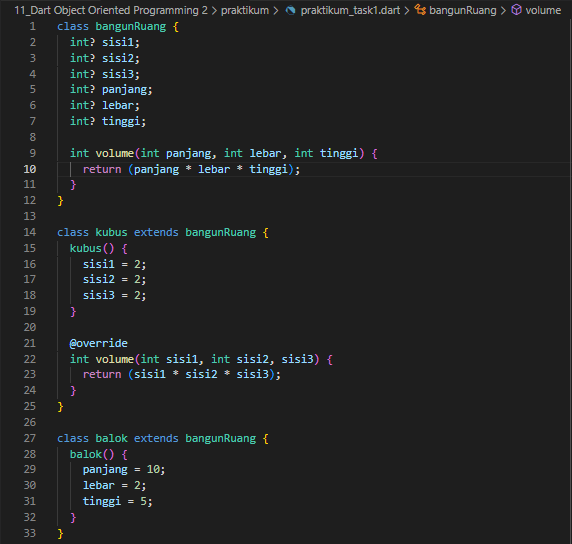
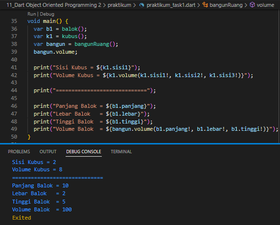
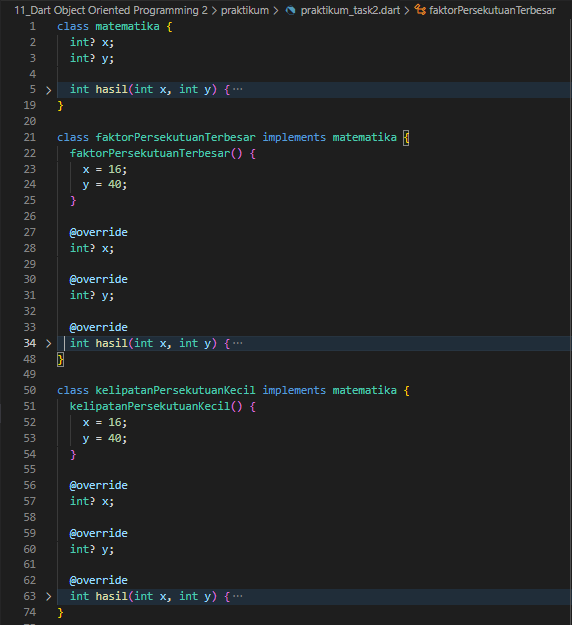
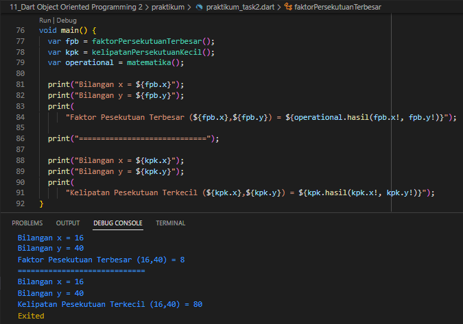

1. Buatlah beberapa class dengan spesifikasi berikut!

| Bangun Ruang | Kubus extends Bangun Ruang | Balok extends Bangun Ruang |
|--------------|----------------------------|----------------------------|
| panjang      | sisi                       |                            |
| lebar        | 
| tinggi       |
| volume()     |



2. Dari rangkaian class di atas, lakukan method overriding untuk membedakan tiap proses dalam method antar class! Sehingga dapat melengkapi kode berikut!

```cs
void main() {
    //lengkapi di sini
    print(bangun.volume());
}
```



3. Buatlah beberapa class dengan spesifikasi berikut!

| Matematika   | KelipatanPersekutuanTerkecil implements Matematika | FaktorPersekutuanTerbesar implements Matematika |
|--------------|----------------------------------------------------|-------------------------------------------------|
| hasil()      | x                                                  | x                                               |
|              | y                                                  | y                                               |



4. Dari rangkaian class di atas, lengkapi kode berikut ini! Sehingga dapat menampilkan hasil pada layar.

```cs
void main() {
    //lengkapi di sini
    print(operatinal.hasil());
}
```


