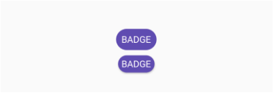
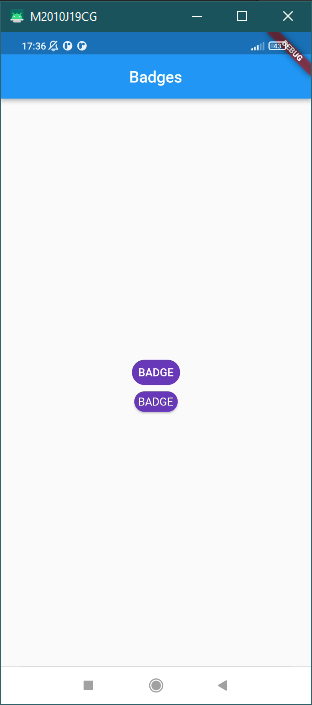
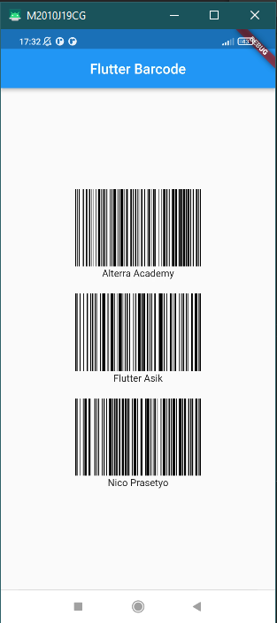

#### SOAL
1. A Menggunakan Package https://pub.dev/packages/badges
1. B Buatlah tampilan berikut ini! 

2. A Menggunakan Package https://pub.dev/packages/barcode_widget
2. B Buatlah tampilan barcode dengan data berikut ini!
a. Alterra Academy
b. Flutter Academy
c. Nama Lengkap Anda

