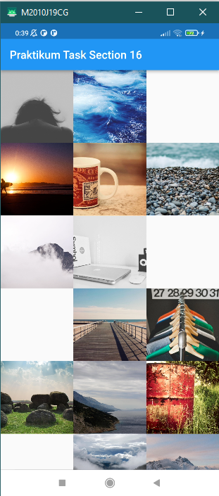
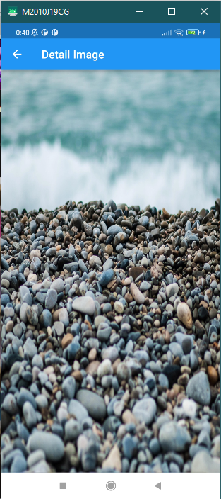

1. Carilah minimum 3 Gambar dari internet, lalu tampilkan menggunakan GridView!

2. Tambahkan fungsionalitas berikut :
a. ketika sebuah gambar ditekan, akan terbuka halaman baru  
b. halaman tersebut menampilkan gambar yang ditekan  
c. gambar ditampilkan memenuhi halaman  

