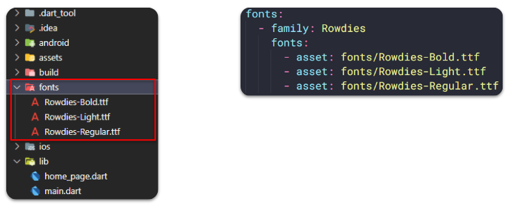
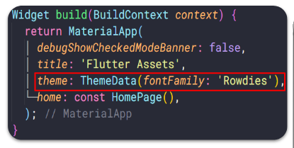
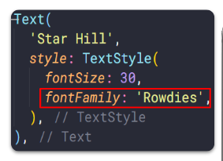
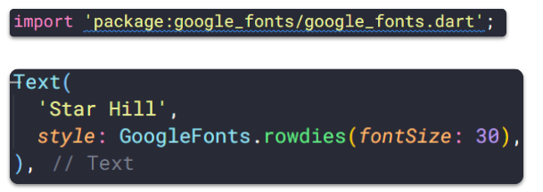
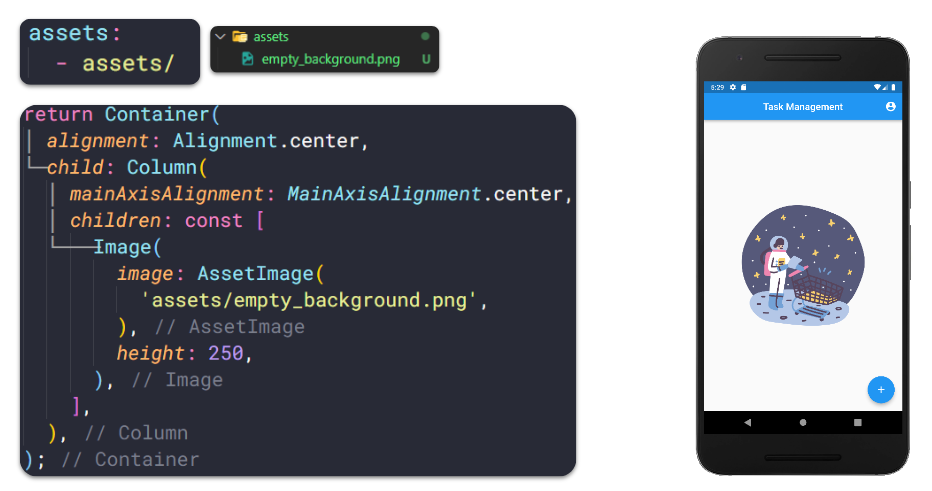
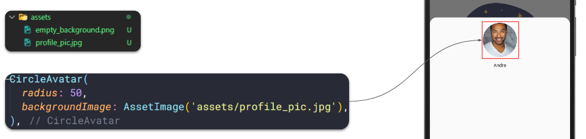
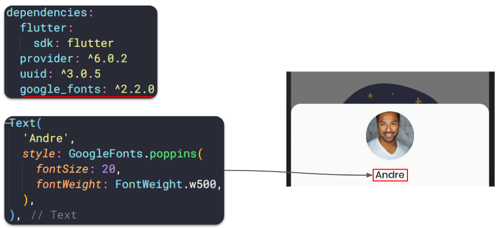
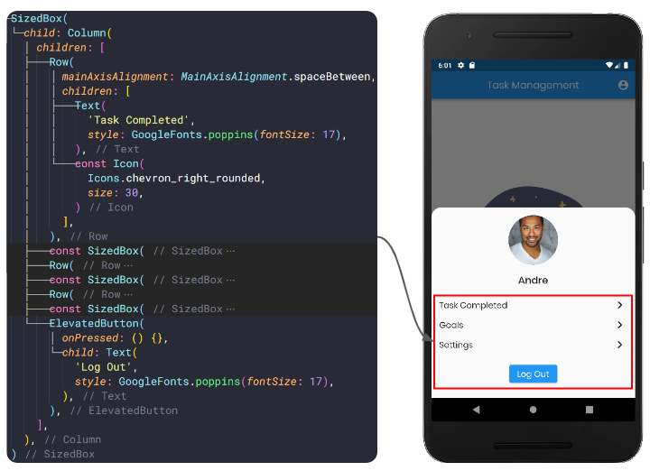

# RESUME SECTION 16 Assets

## Data Diri
Nomor Urut  : 1_016FLC_34 <br>
Nama        : Nico Prasetyo

## Summary Assets

### Assets
- File yang dibundled dan dideployed bersamaan dengan aplikasi 
- Tipe - tipe assets, seperti static data (JSON File), icons, images, dan font file(ttf)

#### Menentukan Assets
- Flutter menggunakan pubspec.yaml
- Pubspec.yaml terletak pada root project, untuk mengidentifikasi assets yang dibutuhkan aplikasi
- Gunakan Karakter "/" untuk memasukan semua assets dibawah satu directory name

```cs
assets:
    - assets/
```

### Image
- Image atau gambar akan membuat tampilan aplikasi menjadi lebih menarik
- Flutter mendukung format gambar seperti JPEG, WebP, GIF, Animated Web/GIF, PNG, BMP, dan WBMP
- Menampilkan gambar dari project asset dan internet

#### Menampilkan Image - 1
- Mengunakan Widget Image
- Membutuhkan propeti image dengan nilai class AssetImage()

```cs
body: Column(
    children: const [
        Image(
            image: AssetImage('assets/xxxxx.png'),
        ),
    ]
)
```

#### Menampilkan Image - 2
- Menggunakan method Image.asset untuk image yang sudah ada pada project
- Menggunakan method Image.network untuk image yang ada pada internet dengan input string url

```cs
body: Column(
    children: const [
        Image.asset('assets/xxxxx.png'),
        Image.network('https://examplepicture/id/5/43/0001'),
    ]
)
```

### Font
- Penggunaan font dengan style tertentu akan menjadi keunikan pada aplikasi 
- Penentuan font yang mau dipakai biasanya oleh UI Designer
- Penerapan font menggunakan custom font atau dari package 

#### Cara Menggunakan Custom Font
- Step 1 <br>
Cari dan Download Font (https://fonts.google.com/)
- Step 2 <br>
Import file .ttf yang sudah didownload dan masukkan pada Daftar font pubspec.yaml

- Step 3 <br>
Mengatur font sebagai default <br>

- Step 4 <br>
Gunakan font dispesifik widget <br>


#### Cara Menggunakan Font dari Package
- Step 1 <br>
Tambahkan package google_fonts didependencies atau search dari pub.dev
- Step 2 <br>
Import package pada file dart lalu gunakan font dengan memanggil GoogleFonts.namaFont() <br>


### Aplikasi Task Management(Continue)
- Menambahkan image pada empty_task_screen.dart


- Membuat Profile Picture di profile_sheet.dart, menggunakan widget CircleAvatar


- Membuat font pada setiap text 


- Menambahkan konten
