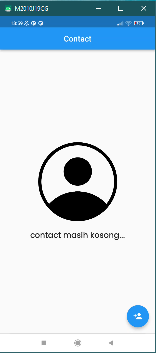
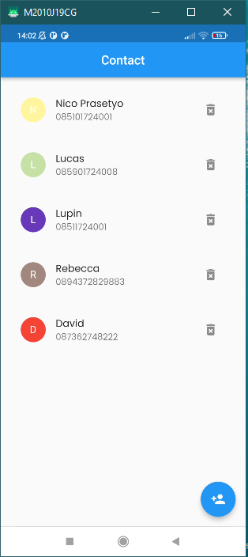
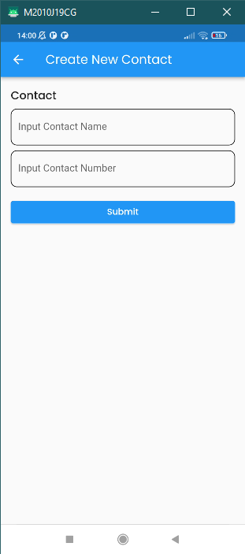

1. Buatlah sebuah halaman dengan spesifikasi berikut:  
a. berjudul “Contacts”,  
b. menampilkan data nama dan nomor telepon (hardcode) dalam List View.  

2. Dari halaman di atas, tambahkan tombol yang mengarah ke halaman baru dengan spesifikasi berikut:  
a. berjudul “Create New Contact’.  
b. menampilkan sebuah form input nama dan nomor telepon,  
c. menampilkan tombol “Submit”.  

