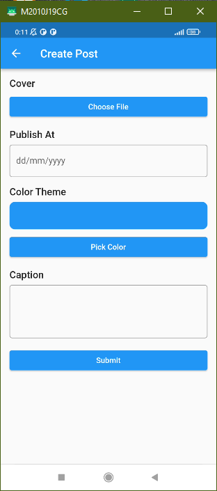
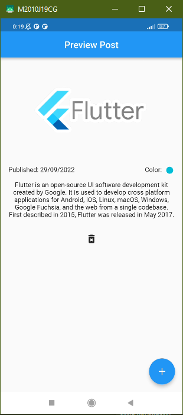

1. Buatlah halaman form yang berjudul Create Post dengan struktur seperti gambar! (contoh ada di alta.id).

.png)

2. Buatlah saat tombol simpan ditekan, tampilkan data pada form ke halaman baru! (contoh ada di alta.id).

