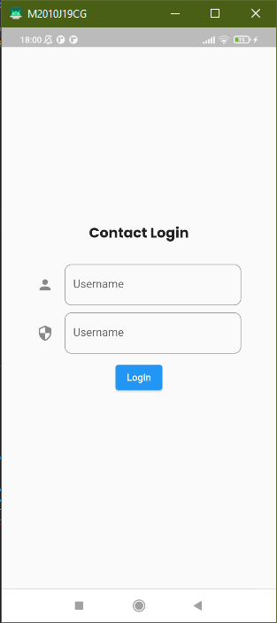
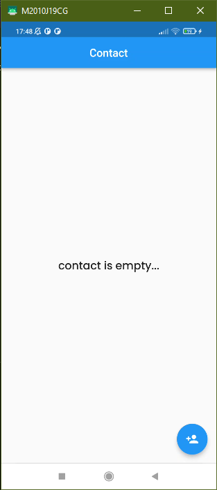
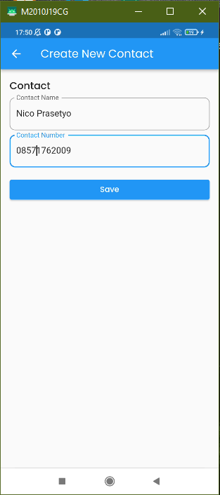
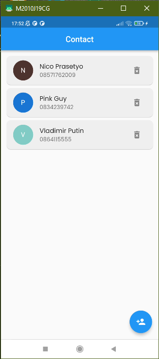

# PRAKTIKUM SECTION 22 Flutter State Management (BLoC)

## Data Diri
Nomor Urut  : 1_016FLC_34  
Nama        : Nico Prasetyo  

#### 1. Buatlah halaman Home & halaman Create Contact, dengan detail sebagai berikut: 
-  Halaman Home akan menampilkan daftar kontak yang sudah didaftarkan dan sebuah tombol untuk navigasi ke halaman Create Contact. 
- Halaman Create Contact terdiri dari 2 kolom untuk mengisi nama, nomor telepon, dan sebuah tombol untuk menyimpan kontak yang baru dibuat. 
- Simpan hasil kontak yang baru dibuat dalam sebuah Map untuk nama dan emailnya. 
- Simpanlah hasil kontak baru di atas, menggunakan bloc. Detail bloc terdiri dari: 
    - Sebuah Event sebagai perintah untuk menyimpan hasil kontaknya 
    - Beberapa State seperti:  
a. Initial (State ini ditampilkan di UI ketika bloc tidak melakukan apa-apa atau dalam status idle). 
b. Loading (State ini ditampilkan di UI ketika bloc mulai melakukan penambahan kontak hingga selesai prosesnya)  
c. Loaded (State ini ditampilkan di UI ketika bloc selesai melakukan penambahan kontak baru, dan menampilkan daftar kontak tersebut ke dalam UI).  
d. Failed (State ini ditampilkan di UI ketika terjadi error pada saat melakukan penambahan kontak baru di bloc).  

#### 2. Buatlah sebuah bloc baru pada aplikasi Contact List sebelumnya. (Bloc baru ini tujuannya bebas, misal untuk menampilkan data diri setelah login dan lain-lain).

## Hasil Output Praktikum Section 21

.png)

.png)

