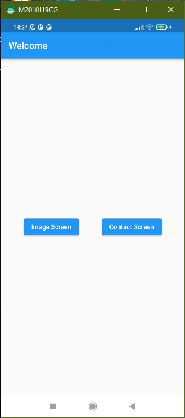
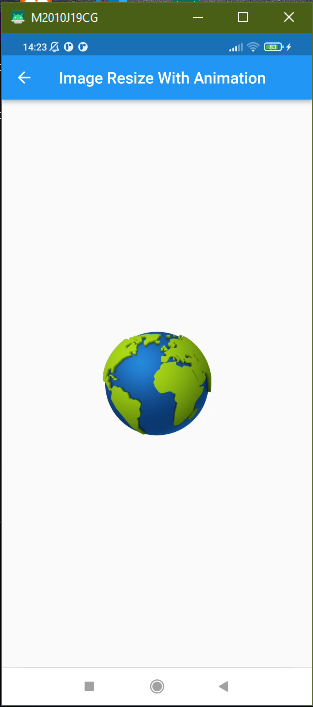
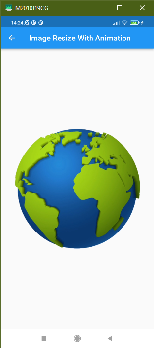
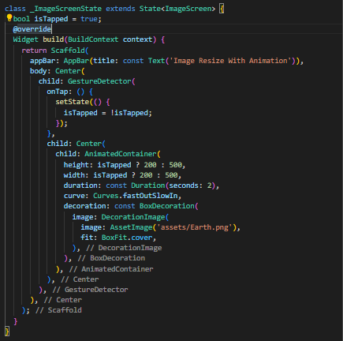
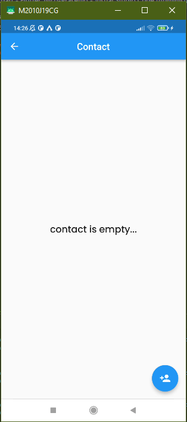
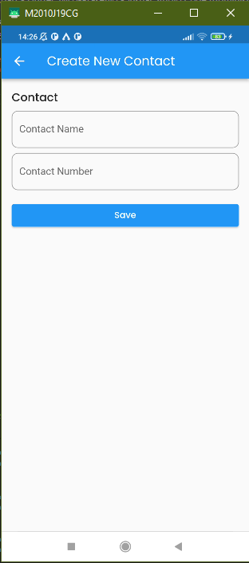
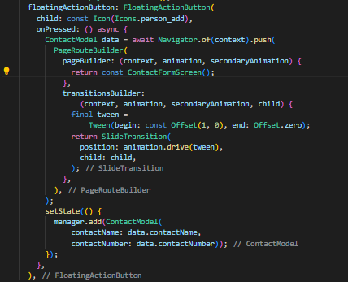

# RESUME SECTION 22 Flutter Animation

## Data Diri
Nomor Urut  : 1_016FLC_34  
Nama        : Nico Prasetyo  

1. Buatlah sebuah halaman dengan spesifikasi berikut:  
a. menampilkan sebuah gambar kecil diposisi tengah  
b. jika gambar diklik akan membesar  
c. jika diklik kembali, akan mengecil (ukuran semula)  
d. proses peubahan gambar menggunakan animasi  

2. Tambahkan Transisi saat perpindahan halaman Contact ke Create Contact!

