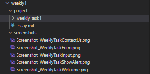
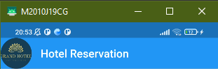
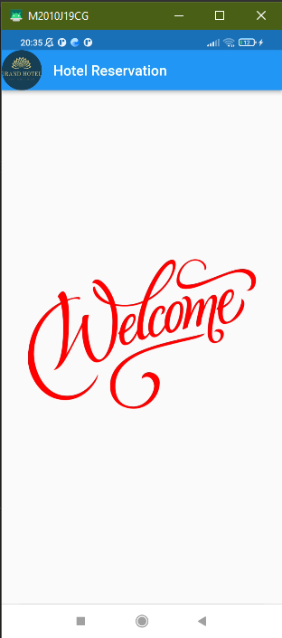
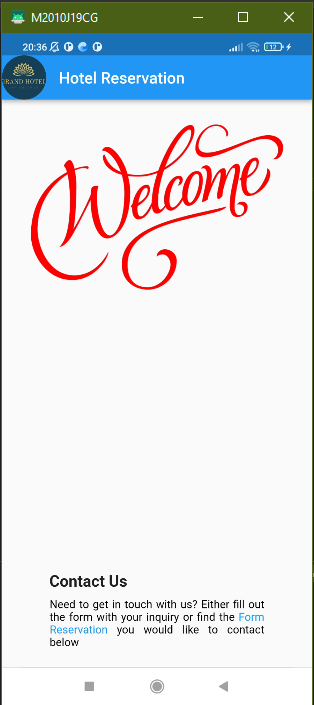
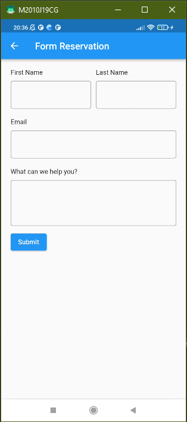
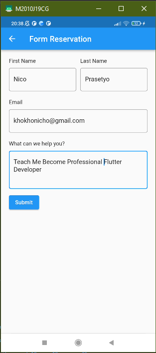
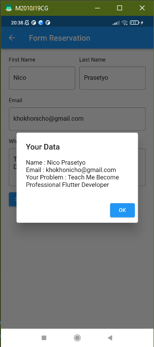

# Task Weekly 1

#### Project 1

1. Buat lah repository pada github dan masukkan program yang telah kalian buat pada repo tersebut. Github ini akan berisi project kalian nanti. Kumpulkan github yang digunakan untuk mengumpulkan tugas. Kumpulkan pada repo yang kalian buat untuk mengumpulkan tugas. Berilah nama foldernya ‘weekly1”  
a. Buat folder project yang berisikan kode yang kalian buat  
b. Buat folder screenshot dan masukkan hasil dari kode yang kalian buat  

2. Buatlah header pada application kalian dengan memiliki  
a. Text atau logo dari aplikasi kalian  

#### Project 2

1. Masih pada halaman yang sama. Jika dilakukan scroll makan akan terdapat welcome section halaman kalian. Dan buatlah beberapa hal  
a. Welcome section (terdapat gambar dan kata-kata yang menarik user)  

2. Masih pada halaman yang sama. Jika dilakukan scroll makan akan terdapat section
contact us dengan kriteria dari aplikasi adalah sebagai berikut  
  
a. Memiliki 3 buat form(username bertime text, email bertime email, message bertipe text area)  
 
b. Memiliki button submit.  
 
c. (optional) jika kita menekan tombol submit maka keluar alert yang berisikan data yang kita masukkan pada form  
