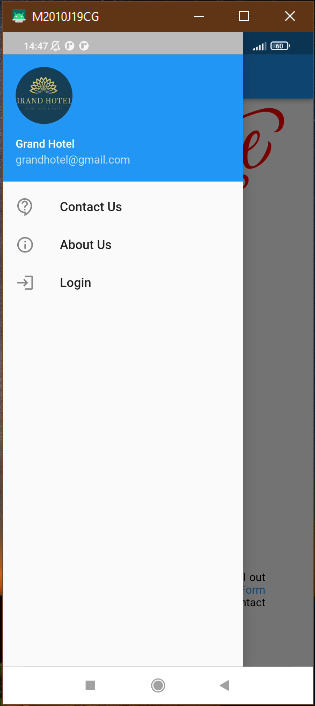
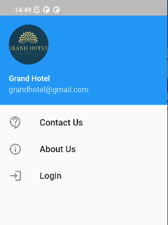
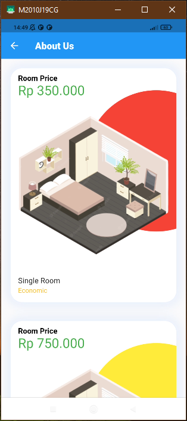
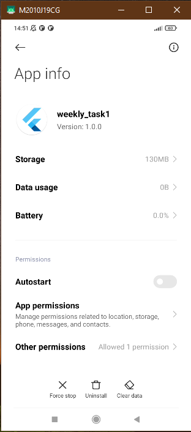
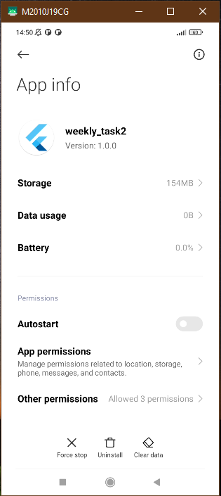

#### Project 1

1. Masih pada halaman yang sama. Buatlah button untuk memunculkan sidebar. Button
sidebar tersebut dapat memunculkan sidebar dari aplikasi. sidebar yang berisikan
navigation button. Terdiri dari 3 navigation button yaitu contact us, abous us, dan login.
Note : navigation button tidak harus berfungsi. Kita disini lebih fokus ke tampilan.

2. Masih pada halaman yang sama. Buatlah sebuah about us section pada aplikasi yang
kalian buat. Terapkan teknik layouting yang kalian pelajari di kelas. About us tersebut
memiliki beberapa komponen yaitu 
a. Terdapat title yang bertuliskan “about us”  
 
b. Terdapat list dari program / jasa / barang yang kalian jual dalam bentuk card  

#### Project 2

1. Kode yang telah kalian buat pada weekly 1 dan 2, lakukanlah commit ke github

2. Lakukan build berdasarkan aplikasi yang telah kalian buat pada flutter. Masukkan hasil
dari build aplikasi kalian ke github.

3. Pasanglah pada hp yang kalian miliki (Dibuktikan dengan screenshot dan masukkan screenshoot kalian ke dalam github)

